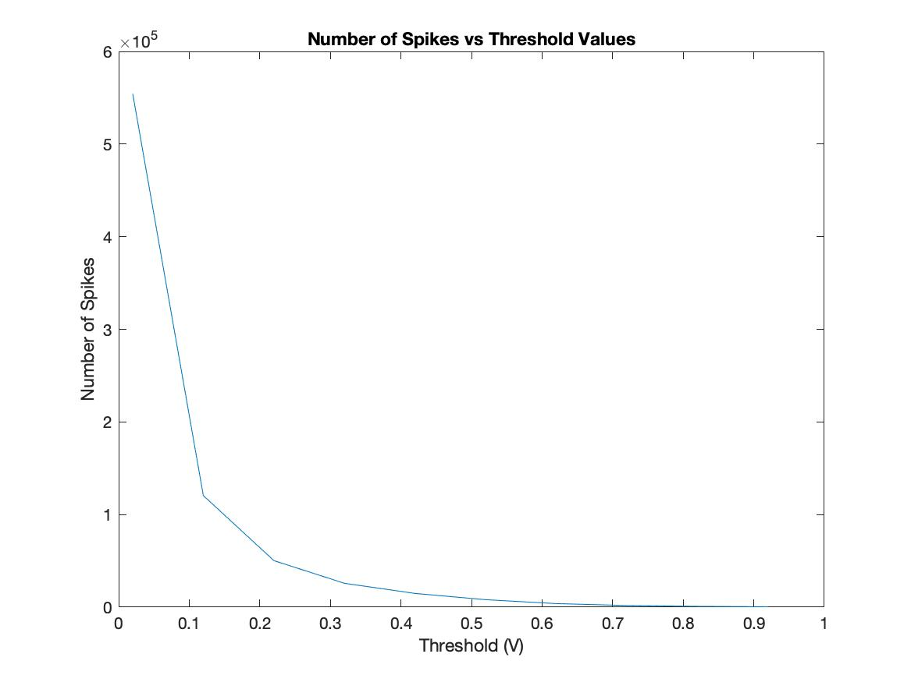
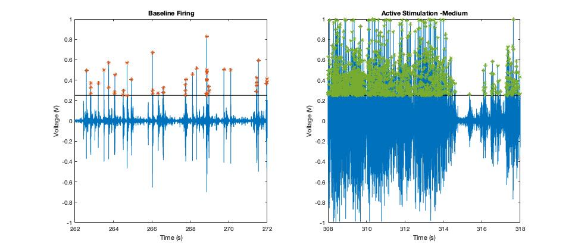
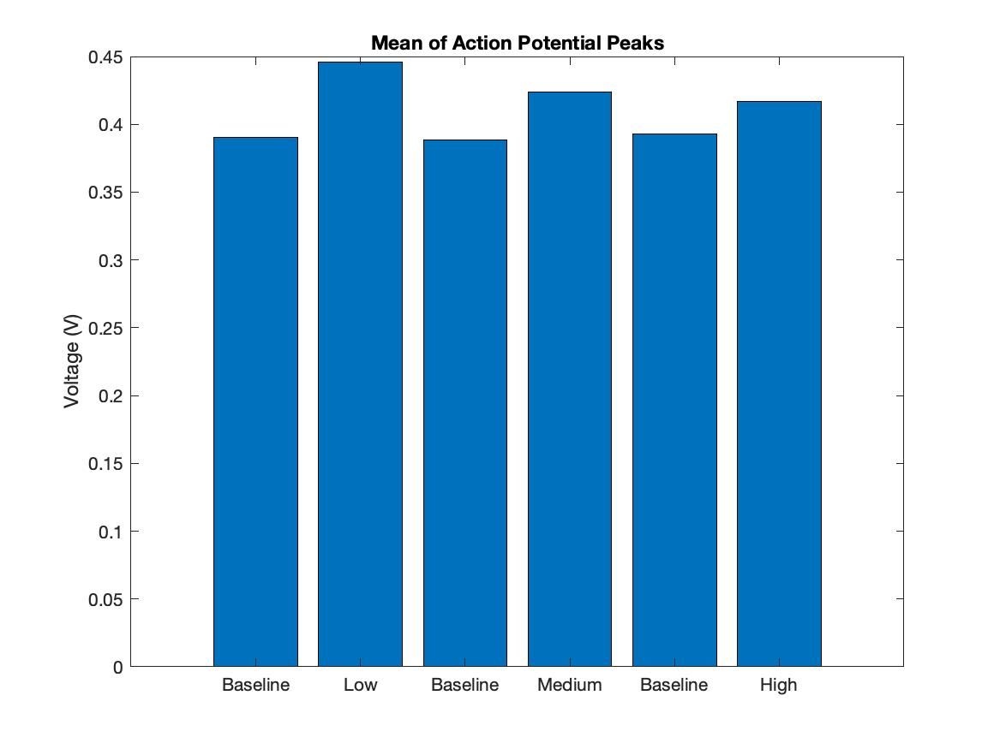

# Assignment 1: Rate Coding and Adaptation
## Introduction
A cockroach leg was dissected and baseline and stimulated action potentials were recorded to infer rate coding and adaptation.
% This is exactly what we did
% This is how I analysed the data

Figure 1: Raw Plot of Extracellular Recording

Figure 2: Raw Data Plots for Baseline and Stimulation for different levels of stimulation

Figure 3: Raw Plots of Extracellular Recording for Adaptation

&nbsp;
&nbsp;
&nbsp;

## Questions
### What happens if you choose threshold too low or too high?

Take a look at the figures showing baseline and stimulus response potentials (Figure 4). If we consider a threshold too low, there will be too many [false positives](https://en.wikipedia.org/wiki/False_positives_and_false_negatives), i.e. peaks that are not necessarily action potentials will be counted as spikes.

If the threshold is too high, we could miss out on action potentials.

Figure 4: Decay of Number of detected spikes as threshold increases. See the rapid decline. At lower thresholds, a lot of noise is detected as signal.
&nbsp;
&nbsp;
&nbsp;
&nbsp;

Figure 5: Plots in Figure 2 with the threshold marked with a line and each individual spikes marked.

### What happens to the firing rate as stimulus strength reduces?

As the stimulus strength is reduced, the firing rate is expected to reduce.

But, considering our threshold, we see the opposite, as indicated in Figure 6.

<Why?>

Figure 6: Bar plot for firing rates indicating rate coding. Note that there is a decrease in the frequency of spikes as the intensity of the stimulus increases

#### Why is it called rate coding?

The relationship between the strength of the stimulus and the spikes of evoked action potentials is called rate coding.

From the neuron's perspective, the strength of the stimulus is being translated to the frequency of spikes. In other words, the strength of the stimulus is being *coded* into the *rate* of spike firing. Hence, this relationship can be aptly called rate coding

#### Why do sensory systems need rate coding?

One of the objectives of a sensory system is to code external cues so that appropriate responses can be executed.

1. Responses are energetically expensive. If a sensory system were not able to differentiate the strength of a stimulus, responses to an external stimulus would be unnecessarily expensive.
2. Different strength of stimuli may require different kinds of responses. Rate coding can be used to switch to an appropriate response depending on the input stimulus. An example of this is muscle 'activation' at the arm on holding different weights at the palm.

&nbsp;
&nbsp;

### Is the mean amplitude same across baseline and stimulus? Why?

Figure 7: This bar plot shows the mean amplitudes across the baseline and stimuli for the three different stimulations provided.

Comment on the amplitudes
same number of neurons
Only frequency changes. Amplitude does not change

&nbsp;
&nbsp;
&nbsp;
&nbsp;
&nbsp;
&nbsp;
&nbsp;
&nbsp;
&nbsp;
&nbsp;
&nbsp;
&nbsp;
&nbsp;
&nbsp;
&nbsp;

## Adaptation
#### How does firing rate change with time?

Figure 8: Adaptation

As indicated in the plot, the firing rate reduces with time. This is consistent with the theory of adaptation, according to which, neurons should fire less frequently for stimuli that lasts for a long time.

#### What do you understand about the sensory system from adaptation?

Sensory systems would rather code changes in external cues than the absolute magnitude of the external cue.

A response is elicited by a change in an external cue or internal state. For a system that responds to changes, an absolute representation of the external cue is not necessary and would be a waste of computational power and energy.
