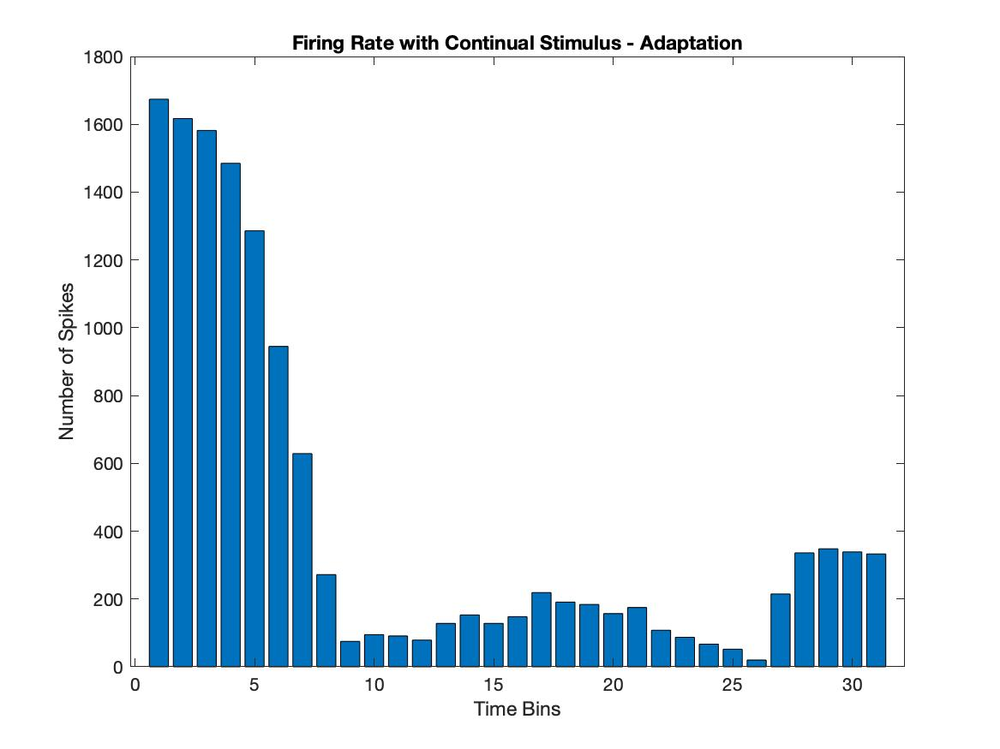

## Questions
### What happens if you choose threshold too low or too high?

Take a look at the figures showing baseline and stimulus response potentials (Figure x). If we consider a threshold too low, there will be too many , i.e. peaks that are not necessarily action potentials will be counted as spikes.

If the threshold is too high, we could miss out on action potentials. (See Interactive Figure for the same)

### What happens to the firing rate as stimulus strength reduces?

As the stimulus strength is reduced, the firing rate is expected to reduce. Considering our threshold, we see that <>, as indicated in Figure x.

#### Why is it called rate coding?

The relationship between the strength of the stimulus and the spikes of evoked action potentials is called rate coding.

From the neuron's perspective, the strength of the stimulus is being translated to the frequency of spikes. In other words, the strength of the stimulus is being *coded* into the *rate* of spike firing. Hence, this relationship can be aptly called rate coding

#### Why do sensory systems need rate coding?

One of the objectives of a sensory system is to code external cues so that appropriate responses can be executed.

1. Responses are energetically expensive. If a sensory system were not able to differentiate the strength of a stimulus, responses to an external stimulus would be unnecessarily expensive.
2. Different strength of stimuli may require different kinds of responses. Rate coding can be used to switch to an appropriate response depending on the input stimulus. An example of this is muscle 'activation' at the arm on holding different weights at the palm.

&nbsp;
&nbsp;
&nbsp;

### Is the mean amplitude same across baseline and stimulus? Why?

This bar plot shows the mean amplitudes across the baseline and stimuli for the three different stimulations provided.
<Comment on the amplitudes>
&nbsp;
&nbsp;
&nbsp;
&nbsp;
&nbsp;
&nbsp;
&nbsp;
&nbsp;
&nbsp;
&nbsp;
&nbsp;
&nbsp;
&nbsp;
&nbsp;
&nbsp;
## Adaptation
#### How does firing rate change with time?

As indicated in the plot, the firing rate reduces with time. This is consistent with the theory of adaptation, according to which, neurons should fire less frequently for stimuli that lasts for a long time.

#### What do you understand about the sensory system from adaptation?

?????
